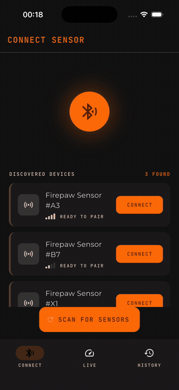
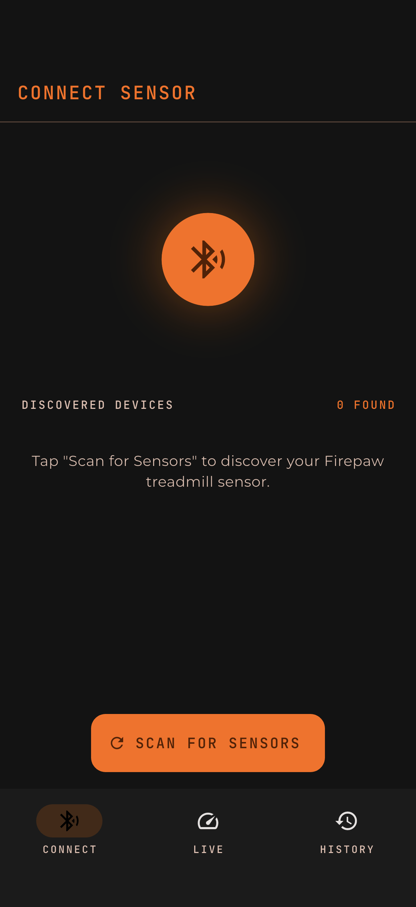
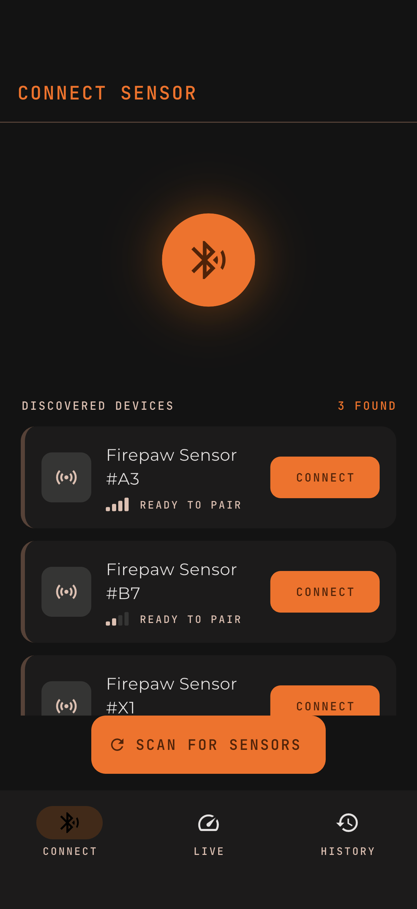
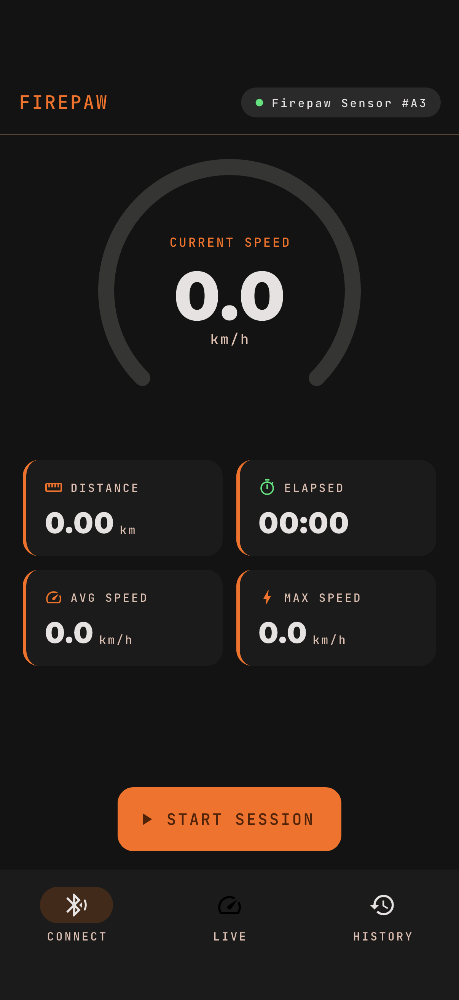
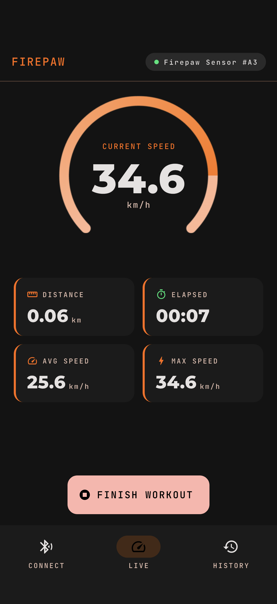
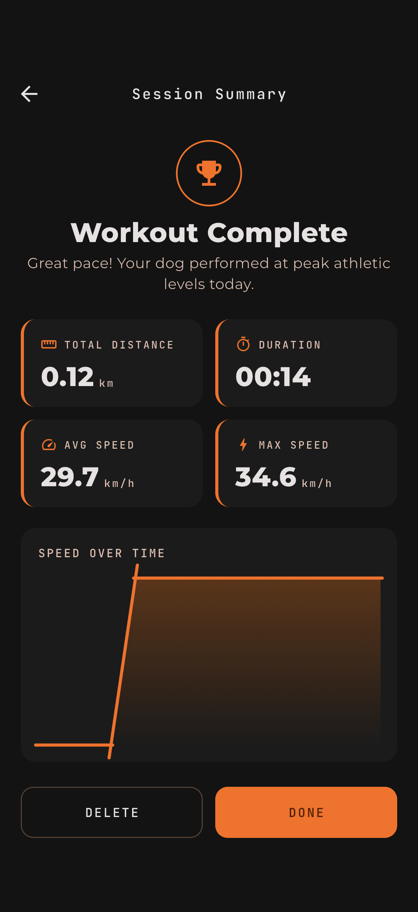
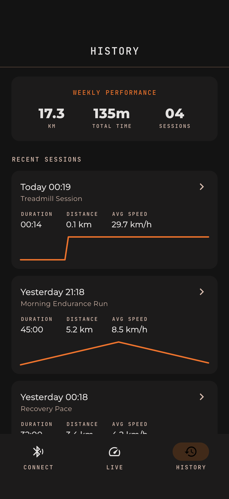
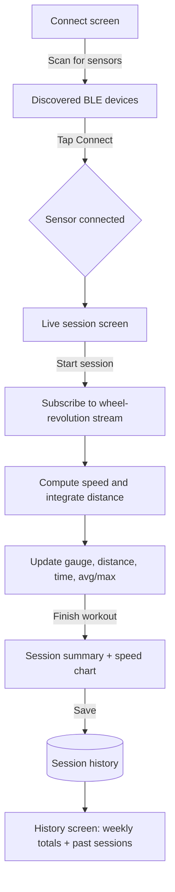

# Firepaw - BLE Dog Treadmill Fitness Tracker

A Flutter MVP for a premium dog-treadmill fitness app. It connects to a Bluetooth Low Energy (BLE) speed sensor on the treadmill, reads wheel-rotation data, calculates live speed and distance, runs start/stop training sessions, and stores session history.

Design-first: the screens were designed in Google Stitch (see `design/`) and the Flutter app is built to match that design.



## What it shows

- **BLE sensor connection** - scan for nearby Firepaw sensors, see signal strength, connect (the BLE transport is simulated behind a tap so the whole app is demoable on a simulator with no hardware).
- **Live speed & distance** - wheel-rotation data (CSC-style cumulative revolutions) is converted to real-time speed and integrated into distance, shown on an animated speedometer gauge with live distance, elapsed time, average and max speed.
- **Training sessions** - start and stop a session; metrics accumulate while it runs.
- **Session summary** - a post-workout summary with totals and a speed-over-time chart.
- **Session history** - weekly totals plus a list of past sessions with per-session sparklines.

## Screenshots

| Connect sensor | Devices found | Live - idle |
| --- | --- | --- |
|  |  |  |

| Live - running | Session summary | History |
| --- | --- | --- |
|  |  |  |

## Architecture

Flutter + Riverpod, structured so the simulated BLE layer can be swapped for real hardware (e.g. `flutter_reactive_ble`) without touching the UI or session logic.

- `lib/ble_service.dart` - `BleService` abstraction + `SimulatedBleService`. Emits `WheelRevolution` events shaped like the Bluetooth CSC Measurement characteristic (cumulative wheel revolutions + last event time).
- `lib/providers.dart` - Riverpod controllers: connection state, the live `SessionController` (derives speed/distance from the revolution stream), and session history.
- `lib/widgets.dart` - reusable UI: `Speedometer` gauge (CustomPainter), stat tiles, sparkline, signal bars.
- `lib/screens/` - connect, live, summary, history screens.

The speed math mirrors a real sensor: `distance += deltaRevolutions * wheelCircumference`, and `speed = deltaMeters / deltaTime`. Swapping in a real sensor means only re-implementing `BleService.wheelRevolutions()`.



## Run

```bash
flutter pub get
flutter run -d "iPhone 17 Pro"
```

Tap **Scan for Sensors**, connect a Firepaw sensor, then **Start Session** to watch live speed and distance.
